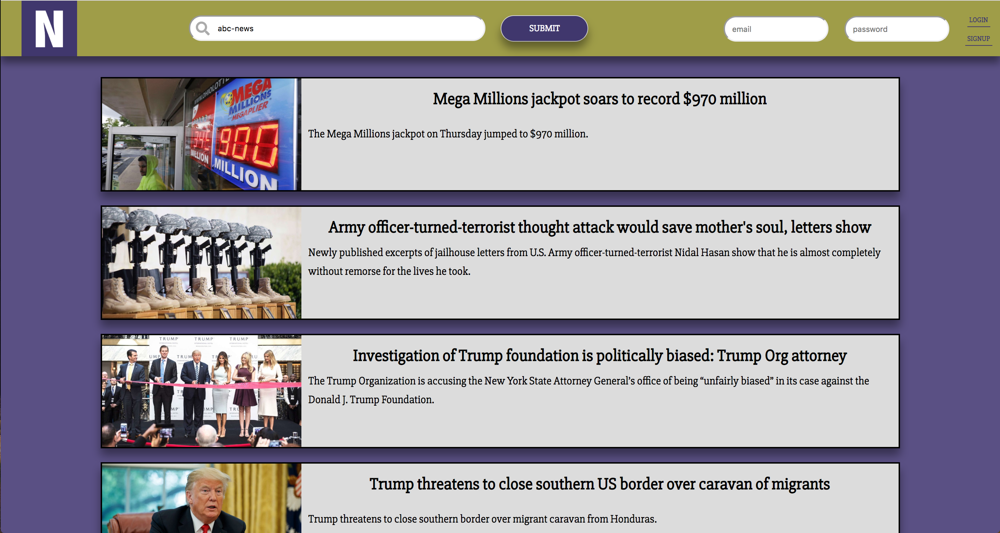

[<h1 align="center">🗞 The News Room 🗞</h1>](https://the-news-room-sp.herokuapp.com/)

The News Room is a one-of-a-kind app that lets you get all of your news in one place.

As news transitions with the growth of modern technology, many consumers have become overwhelmed or confused with so much content coming at them from so many different directions.

How do you consume news? Is it through Facebook, where you scroll through random posts not knowing what you're looking for? Do you visit individual news sites one at a time?

[The News Room](https://the-news-room-sp.herokuapp.com/) makes your life easy by compiling every news source into one place!

Simply search for the news outlet of your choice, and see their top articles!

 [The News Room](https://the-news-room-sp.herokuapp.com/) makes you feel like you're reading every major newspaper in one!

### Installing

Run `git clone https://github.com/SashaPatsel/all-the-news.git` from the command line

## Getting Started

If you'd like to build on this app yourself, clone down this repository, and run `yarn` from both the root and from `/client`.

Then run `yarn start` from the root, and you'll see the app running locally on your own device!

### Prerequisites

- Node
- Create-react-app
- Heroku
- MySQL
- Git
- yarn

## Deployment

- Configure the database settings to match your own specifications

## Built With

* [React](https://reactjs.org/) - Front-End Javascript framework
* [Sass](https://sass-lang.com/
) - CSS compiler and formatter
* [Node](https://nodejs.org/) - Back-End Javascript Framework
* [Express](https://expressjs.com/) - Routing library for Node
* [Passport](www.passportjs.org/) - Authentication library for node
* [MySQL](https://www.mysql.com/) - Database
* [Sequelize](docs.sequelizejs.com/) - ORM for MySQL
* [News API](https://newsapi.org/) - API used for news stories

## Coming soon

- Upvotes
- Saved Stories
- Comments

## Dev Notes
- As of now, the app serves its purpose without giving unique features to each user. However, new features are being explored to tailor each user's experience to their own desires. 
- Very little data is being stored at the momemt, which may raise the question "Why use a relational database like MySQL?". Some of the features that will be added in the future will benefit from a relational databse, the reason is therefore to avoid technical debt in the future. 

## License

This project is licensed under the MIT License - see the [LICENSE.md](LICENSE.md) file for details

## Acknowledgments

* [Amber Burroughs](https://github.com/AmberLBurroughs/Account-Authentication/) For her fantastic React and Passport boilerplate